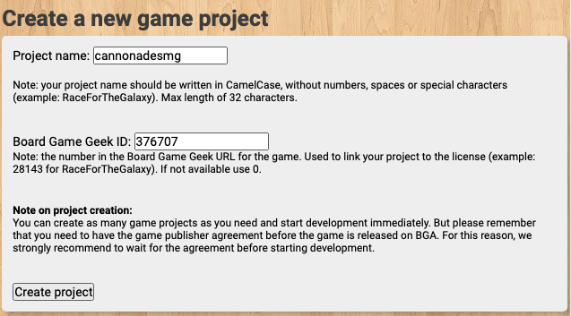
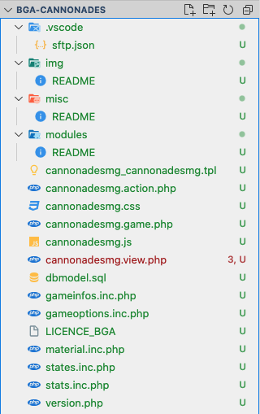

# Mise en place du projet

## Creation d'un projet

[Manage games](https://studio.boardgamearena.com/studio)

En pas de la page, vous pouvez créer un nouveau projet



Pour le **Project name**, saisir le nom du jeu (utiliser un suffixe si le nom du jeu existe déjà)
Pour le **Board Game Geek ID**, saisir le numéro du jeu sur le site. Vous trouverez le numéro du jeu dans l'url de la page du jeu. Par exemple, pour le jeu **Cannonades**, l'url est **<https://boardgamegeek.com/boardgame/376707/cannonades>** donc le numéro du jeu est le **376707**

## Création du dossier sur l'ordinateur

1. Créer un dossier **bga-cannonades** dans votre dossier **Documents** (ou autres dossier de préférence)
2. Ouvrir **Visual Studio Code** dans le dossier **bga-cannonades**
3. Dans **Visual Studio Code**, créer le dossier **.vscode**
4. Dans le dossier **.vscode**, créer le fichier sftp.json
5. Copier le contenu suivant dans ce fichier

    ```json
    {
        "name": "BGA",
        "host": "1.studio.boardgamearena.com",
        "protocol": "sftp",
        "port": 22,
        "username": "...",
        "password": "...",
        "remotePath": "/<Project name>/",
        "uploadOnSave": true,
        "ignore": [
            ".vscode",
            ".git",
            ".DS_Store",
            ".gitignore",
            ".prettierrc",
            "node_modules",
            "src",
            "package.json",
            "package-lock.json",
            "tsconfig.json"
        ],
        "watcher": {
            "files": "**/*.{js,css}",
            "autoUpload": true,
            "autoDelete": false
        }
    }
    ```

6. Remplacer les valeurs **username** et **password** par vos informations obtenus lors de la création de votre compte sur BGA Studio.
7. Remplacer la valeur **remotePath** avec le nom du projet que vous avez créé (Dans ce tutoriel, c'est **"/cannonadesmg/"**)
8. Fermer et relancer **Visual Studio Code** afin de prendre en compte la configuration de la connexion SFTP
9. Pour lancer le téléchargement du code sur le serveur, cliquer sur le bouton de droite dans l'explorateur de **Visual Studio Code** et choisissez **Download Folder**

Voici à quoi devrait ressembler le projet dans **Visual Studio Code**



## Mise en place

### Git

1. Créer un fichier **.gitignore** à la racine du dossier
2. Inséré le contenu suivant

    ```text
    .vscode
    .DS_Store
    img
    node_modules
    ```

*Vous pouvez archiver votre code à ce moment afin d'avoir un étât de départ de votre projet.*

### Filtrer les fichiers

1. Créer un fichier **settings.json** dans le dossier **.vscode**
2. Insérer le contenu suivant

    ```json
    {
        "files.exclude": {
            ".gitignore": true,
            "*.css": true,
            "*.js": true,
            "*.view.php": true,
            "**/README": true,
            "LICENCE_BGA": true,
            "misc": true,
            "node_modules": true,
            "version.php": true
        }
    }
    ```

**Note**: À tout moment, vous pouvez mettre la valeur d'un de ces items à **false** afin d'afficher le ou les fichiers cachés
