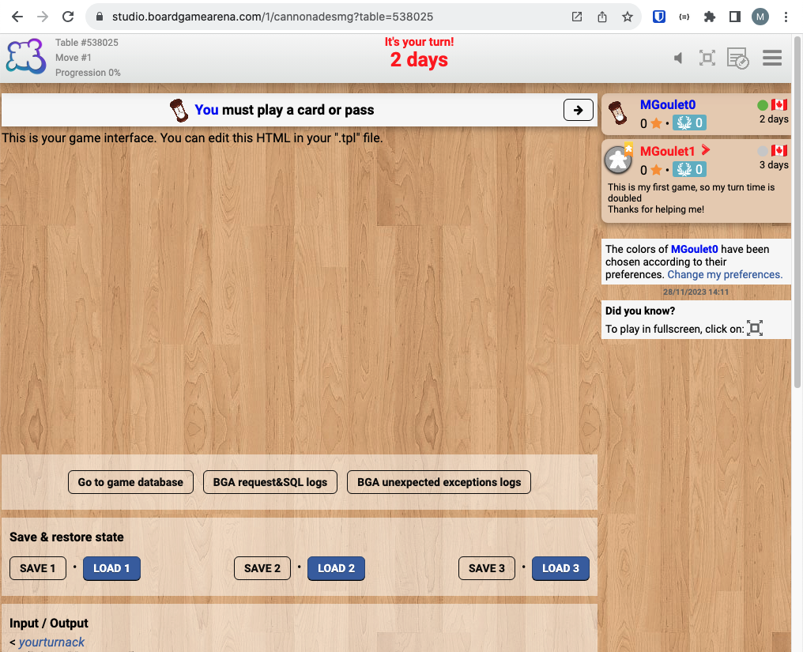

# Mise en place de typescript

## tsconfig

1. Ajouter un fichier **tsconfig.json** à la racine du projet
2. Copier le contenu suivant en remplacant le **outFile** par le nom de votre projet

```json
{
    "rootDir": "src", 
    "compilerOptions": {
      "target": "es5",
      "module": "none",
      "lib": ["dom", "esnext"],  
      "sourceMap": false,
      "outFile": "<Project name>.js",
      "removeComments": true,
      "strict": false,
    },
    "files": [
        "src/bga-framework.d.ts",
        "src/cannonades.d.ts",
        "src/cannonades.ts",
        "src/define.ts"
    ]
}
```

## package.json

1. Dans un terminal, dans le dossier courant, lancer la commande `npm init -y`
2. Remplacer la section script par ceci:

    ```json
    "scripts": {
        "build:ts": "tsc",
        "build:scss": "sass --no-source-map src/cannonades.scss cannonadesmg.css"
    },
    ```

3. Ajouter les modules **typescript** et **sass** avec la commande `npm i -D sass typescript`

4. Lancer les commandes suivantes afin de valider que tout fonctionne correctement

## Configuration vscode

Afin de convertir automatiquement les fichiers typescript en un fichier javascript ainsi que les fichiers scss en un fichier css, dans le fichier **.vscode/settings.json**, ajouter la section suivante au début du fichier

```json
{
    "emeraldwalk.runonsave": {
      "commands": [
         {
            "match": ".*\\.scss$",
            "isAsync": true,
            "cmd": "npm run build:scss"
         },
         {
            "match": ".*\\.ts$",
            "isAsync": true,
            "cmd": "tsc"
         }
      ]
   },
   // ...
}
```

## Dossier src/

Créer le dossier suivant avec la structure suivante

```text
src/
  |- bga-framework.d.ts
  |- cannonades.d.ts
  |- cannonades.scss
  |- cannonades.ts
  |- define.ts
```

### bga-framework.d.ts

Copier le fichier depuis :

### cannonades.d.ts

```ts
interface Cannonades extends ebg.core.gamegui {}

interface CannonadesPlayerData extends BgaPlayer {}

interface CannonadesGamedatas extends BgaGamedatas {
    // player_id: player
    players: Record<string, CannonadesPlayerData>;
}
```

### cannonades.ts

```ts
class Cannonades implements ebg.core.gamegui {
    public setup(gamedatas: any) {
        this.setupNotifications();
    }
    public onEnteringState(stateName: string, args: any) {}
    public onLeavingState(stateName: string) {}
    public onUpdateActionButtons(stateName: string, args: any) {}
    public setupNotifications() {}
}

```

### define.ts

**Note :** Remplacer bgagame.<Project name>

```ts
declare const define;

define([
    "dojo",
    "dojo/_base/declare",
    "ebg/core/gamegui",
    "ebg/counter",
    "ebg/stock",
], function (dojo, declare) {
    return declare(
        "bgagame.<Project name>",
        [ebg.core.gamegui],
        new Cannonades()
    );
});
```

## Vérification

Votre page web devrait toujours ressembler à la section précédente


