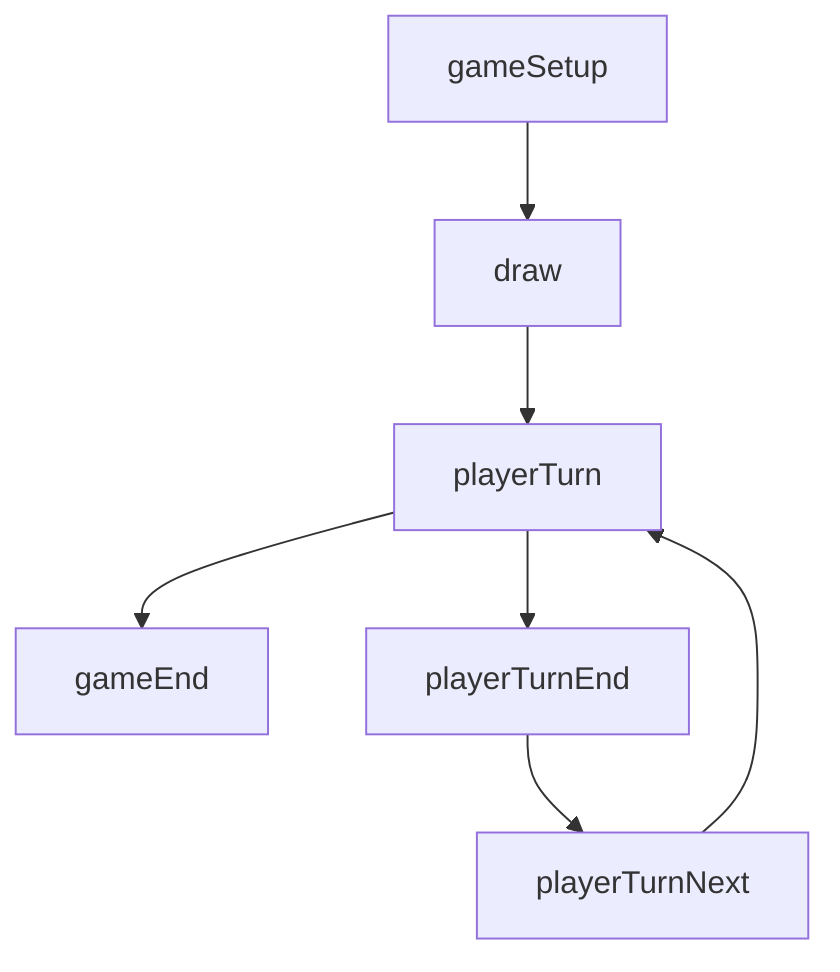

# Mise en place des States

**Note :** Avoir le livret de règlement est essentiel à ce point-ci. Il nous permettra de mettre en place les étâts (states) et leurs transitions.

## Modification des constantes

Dans le fichier `modules/php/constants.inc.php`

```php
<?php

/**
 * States
 */
const ST_BGA_GAME_SETUP = 1;
const ST_BGA_GAME_END = 99;

const ST_PLAYER_TURN = 2;
const ST_PLAYER_NEXT = 3;
```

## Refactoring du fichier states.inc.php

Supprimer le contenu à partir de la ligne 53 $machinestates = array...

**Note :** Nous avons reconduit l'étât #2 pour ne pas faire planté l'application. Si nous supprimons cette étât, l'application ne pourra plus ouvrir.

```php
$basicGameStates = [

    // The initial state. Please do not modify.
    ST_BGA_GAME_SETUP => [
        "name" => "gameSetup",
        "description" => clienttranslate("Game setup"),
        "type" => "manager",
        "action" => "stGameSetup",
        "transitions" => ["" => ST_PLAYER_TURN]
    ],

    // Final state.
    // Please do not modify.
    ST_BGA_GAME_END => [
        "name" => "gameEnd",
        "description" => clienttranslate("End of game"),
        "type" => "manager",
        "action" => "stGameEnd",
        "args" => "argGameEnd",
    ],
];

$gameEngineState = [
    ST_PLAYER_TURN => [
        "name" => "playerTurn",
        "description" => clienttranslate('${actplayer} must play a card or pass'),
        "descriptionmyturn" => clienttranslate('${you} must play a card or pass'),
        "type" => "activeplayer",
        "possibleactions" => ["playCard", "pass"],
        "transitions" => [
            "playCard" => ST_PLAYER_TURN, 
            "pass" => ST_PLAYER_NEXT
        ]
    ],

    ST_PLAYER_NEXT => [
        "name" => "playerNext",
        "type" => "game",
        "action" => "stPlayerNext",
        "transitions" => [
            "" => ST_PLAYER_TURN,
        ]
    ],
];

$machinestates = $basicGameStates + $gameEngineState;
```

### Livre des règles



Possible action during player turn

1. Add
2. Shoot
3. Draw
4. Board a ship

#### First draft of game state

`modules/php/constants.inc.php`

```php
<?php

/**
 * States
 */
const ST_BGA_GAME_SETUP = 1;
const ST_BGA_GAME_END = 99;

const ST_TURN_DRAW = 10;

const ST_PLAYER_TURN = 2;
const ST_PLAYER_TURN_NEXT = 3;
const ST_PLAYER_TURN_END = 4;
```

`states.inc.php`

```php
$basicGameStates = [

    ST_BGA_GAME_SETUP => [
        // ...
        "transitions" => ["" => ST_TURN_DRAW]
    ],

    // ...
];


$gameEngineState = [
    ST_TURN_DRAW => [
        "name" => "draw",
        "type" => "game",
        "action" => "stDraw",
        "transitions" => [
            "" => ST_PLAYER_TURN,
        ],
    ],

    ST_PLAYER_TURN => [
        "name" => "playerTurn",
        "description" => clienttranslate('${actplayer} must play a card or pass'),
        "descriptionmyturn" => clienttranslate('${you} must play a card or pass'),
        "type" => "activeplayer",
        "possibleactions" => [
            "addShip",
            "shootShip",
            "discardShip",
            "boardShip",
            "pass"
        ],
        "transitions" => [
            "next" => ST_PLAYER_TURN,
            "end" => ST_PLAYER_TURN_END,
            "next_player" => ST_PLAYER_TURN_NEXT,
        ],
    ],

    ST_PLAYER_TURN_END => [
        "name" => "playerTurn",
        "description" => clienttranslate('${actplayer} must discard to hand size'),
        "descriptionmyturn" => clienttranslate('${you} must discard to hand size'),
        "type" => "activeplayer",
        "possibleactions" => ["discard"],
        "transitions" => [
            "" => ST_PLAYER_TURN_NEXT,
        ],
    ],

    ST_PLAYER_TURN_NEXT => [
        "name" => "playerNext",
        "type" => "game",
        "action" => "stPlayerNext",
        "transitions" => [
            "" => ST_PLAYER_TURN,
        ],
    ],
];
```

## Mise en place du state UI

Pour gérer plus facilement les states du côté ui, nous allons créer un fichier par state.

```text
src/
  |- states
     |- player-turn.ts
     |- state-manager.ts
  cannonades.d.ts (modify)
  cannonades.ts (modify)
```

### cannonades.d.ts

```ts
interface StateHandler {
    onEnteringState(args: any): void;
    onLeavingState(): void;
    onUpdateActionButtons(args: any): void;
}
```

### src/states/state-manager.ts

```ts
class StateManager {
    private readonly states: Record<string, StateHandler>;

    constructor(private game: Cannonades) {
        this.states = {
            playerTurn: new PlayerTurnState(game),
        };
    }

    onEnteringState(stateName: string, args: any): void {
        console.log(`Entering state: ${stateName}`);
        if (this.states[stateName] !== undefined) {
            this.states[stateName].onEnteringState(args.args);
        }
    }

    onLeavingState(stateName: string): void {
        console.log(`Leaving state: ${stateName}`);
        if (this.states[stateName] !== undefined) {
            this.states[stateName].onLeavingState();
        }
    }

    onUpdateActionButtons(stateName: string, args: any): void {
        console.log(`Update action buttons: ${stateName}`);
        if (this.game.isCurrentPlayerActive()) {
            this.states[stateName].onUpdateActionButtons(args);
        }
    }
}
```

### src/states/player-turn.ts

```ts
class PlayerTurnState implements StateHandler {
    constructor(private game: Cannonades) {}
    onEnteringState(args: any): void {}
    onLeavingState(): void {}
    onUpdateActionButtons(args: any): void {}
}
```

### cannonades.ts

```ts
class Cannonades implements ebg.core.gamegui {
    public stateManager: StateManager;
    public playersTables: PlayerTable[];

    public setup(gamedatas: CannonadesGamedatas) {
        this.stateManager = new StateManager(this);
        this.createPlayerTables(gamedatas);
        this.setupNotifications();
    }
    public onEnteringState(stateName: string, args: any) {
        this.stateManager.onEnteringState(stateName, args);
    }
    public onLeavingState(stateName: string) {
        this.stateManager.onLeavingState(stateName);
    }
    public onUpdateActionButtons(stateName: string, args: any) {
        this.stateManager.onUpdateActionButtons(stateName, args);
    }
    // ...
}
```

## Vérification

Ouvrir la console du navigateur, actualiser et vous devriez avoir dans la console de log

```log
Update action buttons: playerTurn
Entering state: playerTurn
```

## Ajout des boutons d'actions

### modules/php/Trait/Args.php

Pour le moment, on va retourner toujours vrai mais lorsqu'on aura créé les cartes, on pourra vérifier le maximum de carte en jeu et avoir un indicateur qui suit les règles

```php
function argPlayerTurn() {
    return [
        'can_add_ship' => true,
    ];
}
```

### states.inc.php

```php
ST_PLAYER_TURN => [
    "name" => "playerTurn",
    "description" => clienttranslate('${actplayer} must play a card or pass'),
    "descriptionmyturn" => clienttranslate('${you} must play a card or pass'),
    "args" => "argPlayerTurn",
    "type" => "activeplayer",
    // ...
],
```

### cannonades.ts

On va se créer des méthodes pour ajouter des boutons de couleurs à la fin du fichier en plus d'ajouter un moyen de les activés et de les désactivés.

```ts
public addPrimaryActionButton(id, text, callback): void {
    if (!document.getElementById(id)) {
        this.addActionButton(id, text, callback, null, false, "blue");
    }
}

public addSecondaryActionButton(id, text, callback): void {
    if (!document.getElementById(id)) {
        this.addActionButton(id, text, callback, null, false, "gray");
    }
}

public addDangerActionButton(id, text, callback): void {
    if (!document.getElementById(id)) {
        this.addActionButton(id, text, callback, null, false, "red");
    }
}

public toggleButton(id: string, enabled: boolean): void {
    document.getElementById(id)?.classList.toggle('disabled', !enabled);
}
```

### src/states/player-turn.ts

```ts
class PlayerTurnState implements StateHandler {
   constructor(private game: Cannonades) {}
   onEnteringState(args: any): void {}
   onLeavingState(): void {}
   onUpdateActionButtons({can_add_ship}: PlayerTurnArgs): void {
      const handleAdd = () => {
         this.game.setClientState('playerTurnAdd', {
            description: _(''),
            args: {},
         });
      };
      const handleShoot = () => {
         this.game.setClientState('playerTurnShoot', {
            description: _(''),
            args: {},
         })
      };
      const handleDraw = () => {
         this.game.setClientState('playerTurnDraw', {
            description: _(''),
            args: {},
         })
      };
      const handleBoard = () => {
         this.game.setClientState('playerTurnBoard', {
            description: _(''),
            args: {},
         })
      };
      
      this.game.addPrimaryActionButton("btn_add", _("Add a new ship"), handleAdd);
      this.game.addPrimaryActionButton("btn_shoot", _("Shoot an opponent's ship"), handleShoot);
      this.game.addPrimaryActionButton("btn_draw", _("Discard a ship to draw"), handleDraw);
      this.game.addPrimaryActionButton("btn_board", _("Board a ship"), handleBoard);

      this.game.toggleButton('btn_add', can_add_ship);
   }
}

interface PlayerTurnArgs {
   can_add_ship: boolean;
}
```